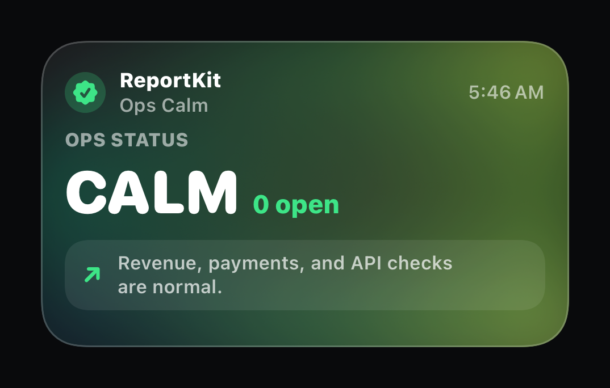
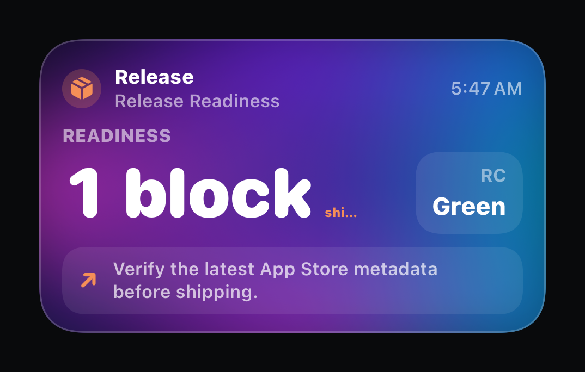
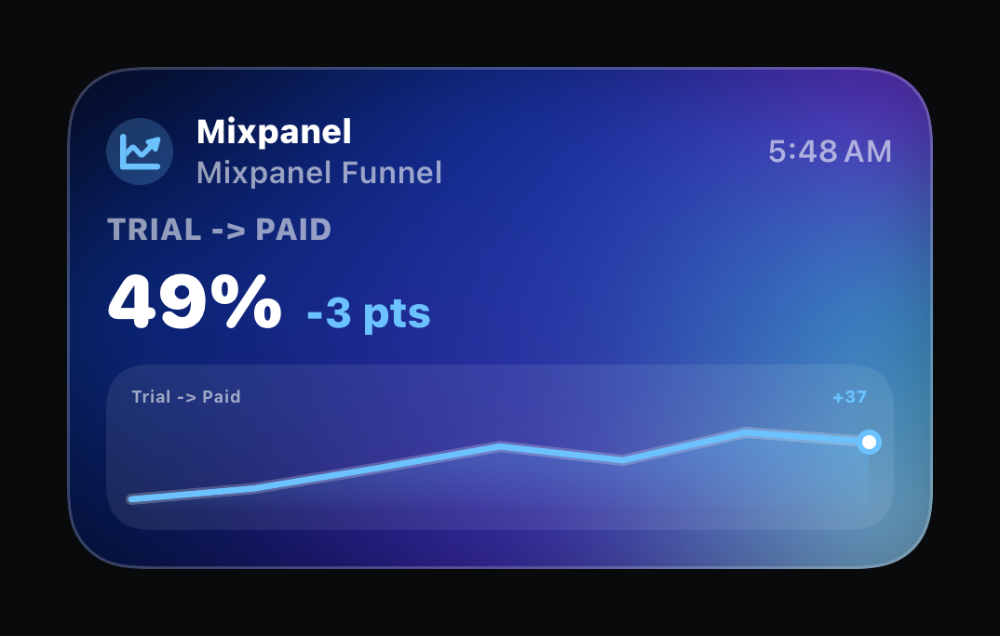
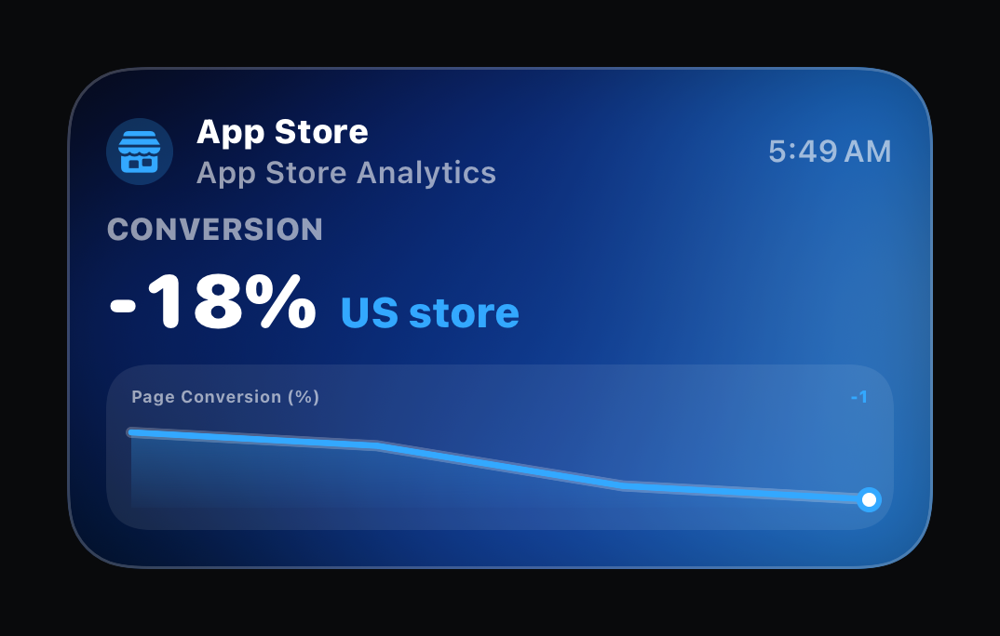
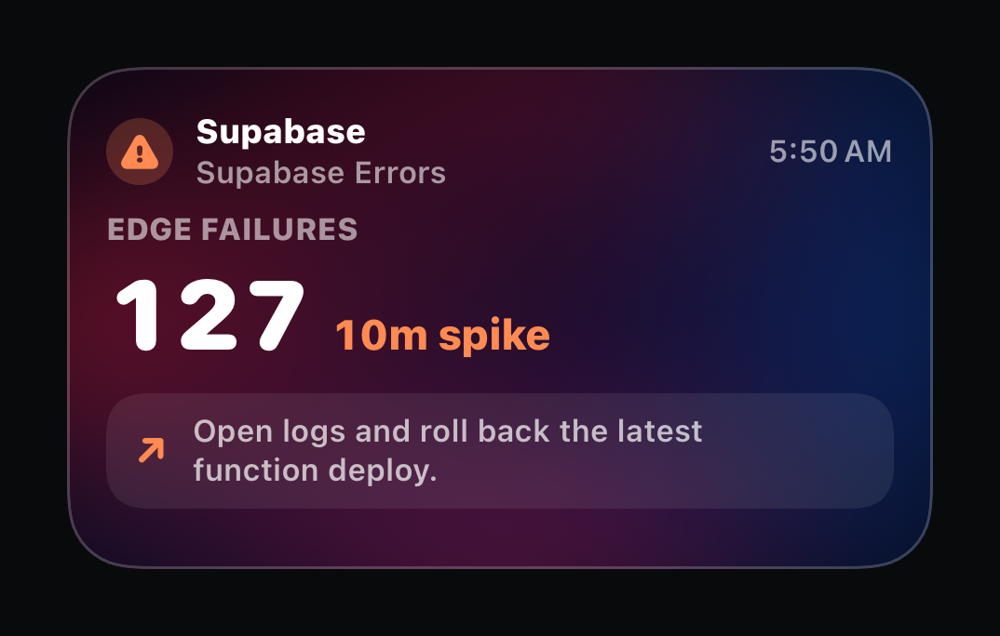
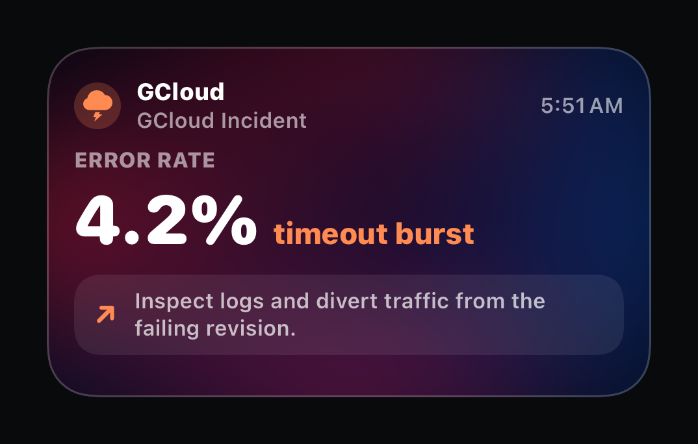
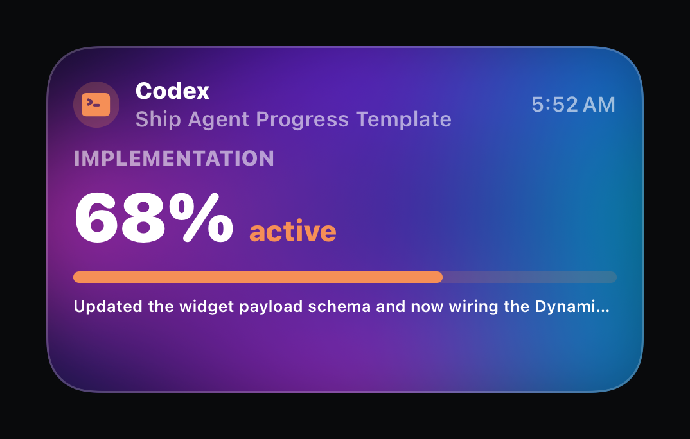
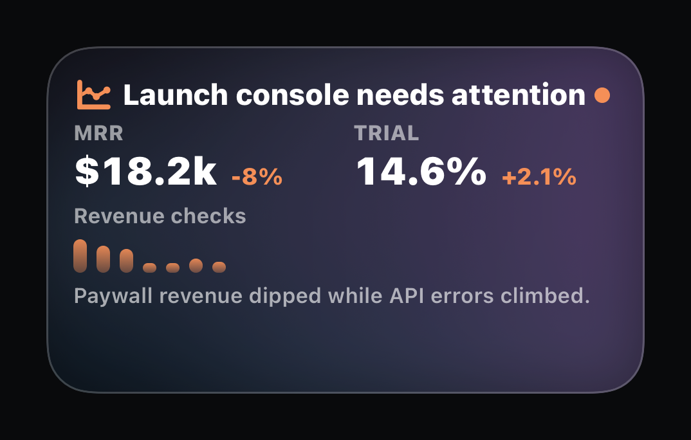
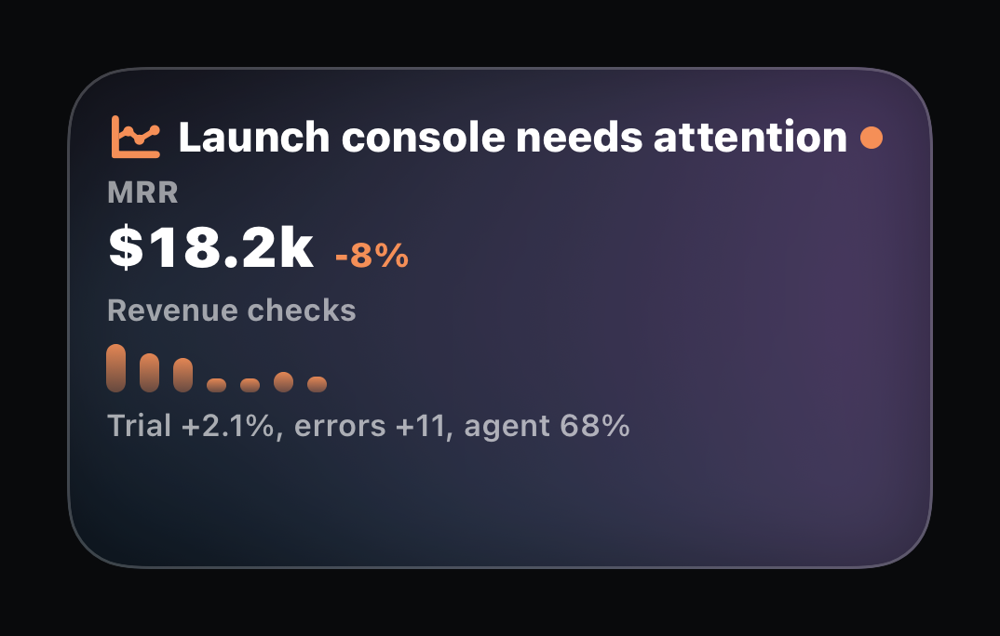

# ReportKit Codex Skills

Public Codex skills for setting up and running ReportKit automations.

This repo contains two skills:

- `$reportkit-setup`: use when a person asks an agent to set up an automation that should send ReportKit updates.
- `$reportkit-execution`: use inside the automation when the agent has evaluated state and needs to send or skip the ReportKit update.

The split matters: setup is conversational and designs the report contract; execution is narrow, secret-safe, and sends with `reportkit send --file payload.json`.

ReportKit sends can target multiple iPhone surfaces:

- `live_activity`: Dynamic Island / Lock Screen Live Activity updates.
- `widget`: Home Screen / Lock Screen WidgetKit refresh snapshots.
- `notification`: grouped APNs alert notifications with `notification.threadId`.
- Control Widget state updates through `notification.control`.

## Live Activity Examples

Use this skill when you want an agent to send focused, action-oriented Live Activity updates instead of another chat notification.

| Ops Calm | Release Readiness | Mixpanel Funnel |
| --- | --- | --- |
|  |  |  |

| App Store Analytics | Supabase Errors | GCloud Incident |
| --- | --- | --- |
|  |  |  |

| Codex Agent Progress | Builder Launch Console | Builder Compact Console |
| --- | --- | --- |
|  |  |  |

## Install

Ask your agent to install this skill repo, for example:

```text
Install https://github.com/AndreasInk/ReportKit-Skill.git so I can set up ReportKit automations.
Use $reportkit-setup when we are designing or installing an automation.
Use $reportkit-execution inside the automation when it is time to send or skip.
```

Then start with `$reportkit-setup` when asking Codex to configure a report, monitor, schedule, CI check, or agent workflow.

Inside an automation prompt, include `$reportkit-execution` so the runtime agent uses the stricter send/skip rules.

## Repo Contents

- `reportkit-setup/SKILL.md`
- `reportkit-execution/SKILL.md`
- `assets/live-activity-previews/`

## More Info

Read the docs here: 
https://andreas.craft.me/qtX8oWJYSSxbJ2
